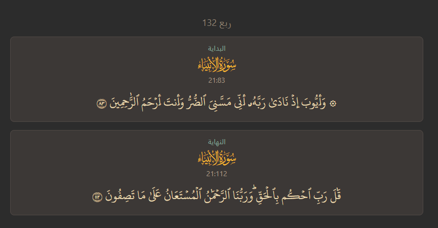

## How to use

Just import the `.apkg` Anki deck. More details on how to best tweak the parameters are to come.

## About the deck

This deck consists of 240 cards, one per rub' al-hizb (ربع الحزب) — a quarter of a hizb, or an eighth of a juz. I chose this as the minimum viable unit of revision.

This is how the deck looks:

## Getting the deck

**Option 1:** Download the pre-built deck directly from the [latest release](https://github.com/hegzploit/Anki-Quran-Revision/releases/latest/download/quran-rub.apkg).

**Option 2:** Clone the repo and generate it yourself by running `main.py`.
