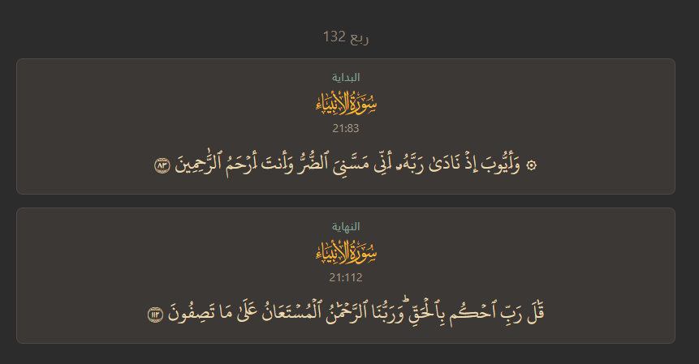

## How to use

Just import the `.apkg` Anki deck. More details on how to best tweak the parameters are to come.

## About the decks

Three variants are generated, each carving the Quran into a different unit of revision. Every card shows the unit's opening and closing ayah, so you can test whether you know where a section starts and ends.

| Deck | Cards | Unit |
| --- | --- | --- |
| `quran-rub.apkg` | 240 | one rub' al-hizb (ربع الحزب) — a quarter of a hizb, or an eighth of a juz |
| `quran-page.apkg` | 604 | one page of the standard mushaf |
| `quran-surah.apkg` | 114 | one surah |

This is how a card looks:

## Getting the decks

**Option 1:** Download the pre-built decks directly from the [latest release](https://github.com/hegzploit/Anki-Quran-Revision/releases/latest).

**Option 2:** Clone the repo and generate them yourself by running `main.py`.
